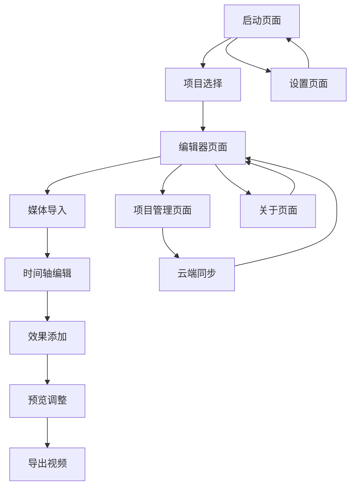

# OpenCut 桌面应用产品需求文档

## 1. 产品概述

OpenCut 桌面应用是基于现有 Web 版本的原生桌面视频编辑器，通过 Tauri 框架实现跨平台支持。应用将 Web 技术的灵活性与原生桌面应用的性能和系统集成能力相结合，为用户提供更强大的视频编辑体验。

桌面版本解决了 Web 版本在文件访问、性能优化和离线使用方面的限制，同时保持了现有的用户界面和工作流程。目标是成为专业级开源视频编辑软件的有力竞争者。

## 2. 核心功能

### 2.1 用户角色

| 角色     | 使用方式            | 核心权限                             |
| -------- | ------------------- | ------------------------------------ |
| 普通用户 | 本地安装使用        | 基础视频编辑、本地项目管理、云端同步 |
| 专业用户 | 付费账户 + 桌面应用 | 高级编辑功能、批量处理、插件扩展     |
| 企业用户 | 团队许可证          | 协作功能、企业级存储、自定义品牌     |

### 2.2 功能模块

桌面应用包含以下核心页面：

1. **启动页面**：项目管理、最近项目、模板选择
2. **编辑器页面**：时间轴编辑、预览窗口、工具面板、资源库
3. **项目管理页面**：本地项目浏览、云端同步、导入导出
4. **设置页面**：应用偏好、硬件配置、插件管理
5. **关于页面**：版本信息、更新检查、帮助文档

### 2.3 页面详情

| 页面名称     | 模块名称     | 功能描述                                               |
| ------------ | ------------ | ------------------------------------------------------ |
| 启动页面     | 项目管理器   | 显示最近项目、创建新项目、导入现有项目、项目搜索和筛选 |
| 启动页面     | 模板中心     | 预设模板浏览、模板预览、快速创建项目                   |
| 启动页面     | 快速操作     | 直接导入媒体文件、打开文件夹、恢复崩溃项目             |
| 编辑器页面   | 时间轴编辑器 | 多轨道编辑、精确剪切、关键帧动画、转场效果             |
| 编辑器页面   | 预览窗口     | 实时预览、全屏播放、播放控制、预览质量调节             |
| 编辑器页面   | 资源面板     | 媒体库管理、素材导入、文件预览、标签分类               |
| 编辑器页面   | 工具栏       | 剪切工具、文本工具、滤镜效果、音频处理                 |
| 编辑器页面   | 属性面板     | 选中元素属性编辑、动画设置、效果参数调整               |
| 项目管理页面 | 本地项目     | 本地项目列表、项目信息编辑、项目删除和备份             |
| 项目管理页面 | 云端同步     | 云端项目同步、冲突解决、离线模式管理                   |
| 项目管理页面 | 导入导出     | 项目导入、项目导出、格式转换、批量操作                 |
| 设置页面     | 应用偏好     | 界面主题、语言设置、自动保存、快捷键配置               |
| 设置页面     | 性能设置     | 硬件加速、内存限制、缓存管理、预览质量                 |
| 设置页面     | 插件管理     | 插件安装、插件配置、插件更新、插件开发                 |
| 关于页面     | 版本信息     | 当前版本、更新日志、系统信息、许可证信息               |
| 关于页面     | 帮助支持     | 用户手册、视频教程、社区论坛、问题反馈                 |

## 3. 核心流程

### 3.1 新用户首次使用流程

1. 下载并安装桌面应用
2. 首次启动，显示欢迎向导
3. 选择工作目录和基本设置
4. 创建第一个项目或导入现有媒体
5. 进入编辑器，显示功能引导

### 3.2 日常编辑工作流程

1. 启动应用，从启动页选择项目
2. 导入媒体文件到资源库
3. 将媒体拖拽到时间轴进行编辑
4. 添加效果、转场和文本
5. 预览和调整编辑内容
6. 导出最终视频文件

### 3.3 项目协作流程

1. 创建项目并设置为协作模式
2. 邀请团队成员加入项目
3. 同步项目到云端
4. 团队成员下载并编辑
5. 解决编辑冲突并合并更改

## 4. 用户界面设计

### 4.1 设计风格

- **主色调**：深色主题 (#1a1a1a)，辅助色彩 (#3b82f6)
- **按钮样式**：圆角矩形，悬停效果，现代扁平化设计
- **字体**：系统默认字体，标题 16-24px，正文 14px，小字 12px
- **布局风格**：响应式网格布局，可调整面板，工具栏固定
- **图标风格**：线性图标，统一风格，支持主题切换

### 4.2 页面设计概览

| 页面名称     | 模块名称     | UI 元素                                                    |
| ------------ | ------------ | ---------------------------------------------------------- |
| 启动页面     | 项目管理器   | 网格布局项目卡片，搜索框，筛选按钮，创建项目按钮 (#3b82f6) |
| 启动页面     | 模板中心     | 横向滚动模板列表，预览缩略图，分类标签                     |
| 编辑器页面   | 时间轴编辑器 | 深色背景 (#2d2d2d)，多轨道显示，缩放控制，播放头指示器     |
| 编辑器页面   | 预览窗口     | 16:9 比例预览区，播放控制按钮，全屏切换，质量选择下拉菜单  |
| 编辑器页面   | 工具面板     | 垂直工具栏，图标按钮，工具提示，分组分隔线                 |
| 项目管理页面 | 项目列表     | 表格视图，排序功能，批量操作复选框，状态指示器             |
| 设置页面     | 选项卡       | 左侧导航菜单，右侧设置面板，保存/取消按钮                  |

### 4.3 响应式设计

桌面应用主要针对桌面环境设计，支持以下特性：

- **最小窗口尺寸**：1024x768
- **推荐尺寸**：1920x1080 或更高
- **面板调整**：可拖拽调整面板大小
- **全屏支持**：编辑器和预览的全屏模式
- **多显示器**：支持多显示器扩展工作区

## 5. 桌面应用特有功能

### 5.1 文件系统集成

- **拖拽导入**：直接从文件管理器拖拽文件到应用
- **文件关联**：支持常见视频格式的文件关联
- **快速访问**：最近使用文件和文件夹快速访问
- **批量导入**：文件夹批量导入和处理

### 5.2 系统集成功能

- **原生菜单**：系统菜单栏集成，快捷键支持
- **系统通知**：导出完成、错误提醒等系统通知
- **系统托盘**：最小化到系统托盘，快速操作
- **开机启动**：可选的开机自动启动

### 5.3 性能优化功能

- **硬件加速**：GPU 加速视频处理和预览
- **多线程处理**：后台多线程媒体处理
- **智能缓存**：预览缓存和素材缓存管理
- **内存优化**：大文件流式处理，内存使用优化

### 5.4 离线功能

- **离线编辑**：完全离线的项目编辑能力
- **本地存储**：项目和设置的本地存储
- **离线导出**：无需网络连接的视频导出
- **同步恢复**：网络恢复后的自动同步

## 6. 技术要求

### 6.1 性能指标

- **启动时间**：< 3 秒（冷启动）
- **响应时间**：UI 操作 < 100ms 响应
- **内存使用**：基础功能 < 500MB
- **CPU 使用**：空闲状态 < 5%

### 6.2 兼容性要求

- **Windows**：Windows 10 1903+ (64 位)
- **macOS**：macOS 10.15+ (Intel/Apple Silicon)
- **Linux**：Ubuntu 18.04+, Fedora 32+

### 6.3 安全要求

- **代码签名**：所有平台的代码签名
- **自动更新**：安全的自动更新机制
- **数据加密**：敏感数据本地加密存储
- **权限控制**：最小权限原则，用户授权

## 7. 发布计划

### 7.1 开发阶段

1. **Alpha 版本**：基础功能实现，内部测试
2. **Beta 版本**：功能完善，公开测试
3. **RC 版本**：发布候选，稳定性测试
4. **正式版本**：公开发布，持续维护

### 7.2 功能优先级

- **P0（必须）**：基础编辑、文件导入导出、项目管理
- **P1（重要）**：云端同步、性能优化、系统集成
- **P2（可选）**：高级效果、插件系统、协作功能
- **P3（未来）**：AI 功能、移动端同步、企业功能
