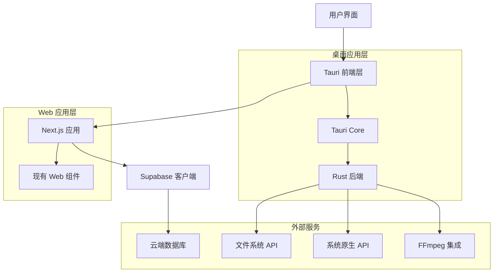
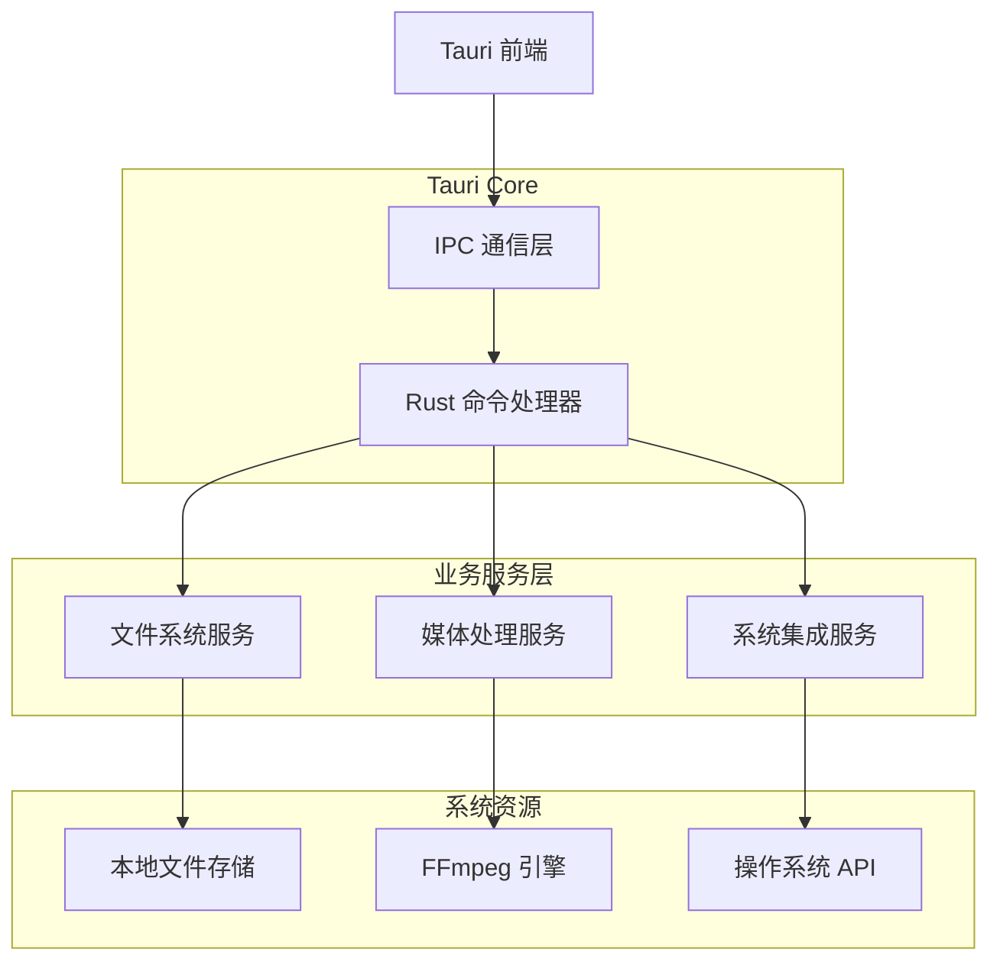
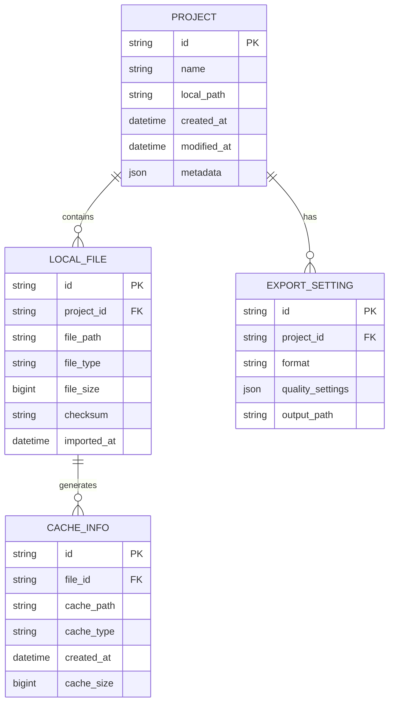

# OpenCut Tauri 集成技术架构文档

## 1. 架构设计

### 1.1 整体架构图



### 1.2 项目结构设计

```
OpenCut/
├── apps/
│   ├── desktop/                 # 新增：Tauri 桌面应用
│   │   ├── src-tauri/          # Tauri Rust 后端
│   │   │   ├── src/
│   │   │   │   ├── main.rs
│   │   │   │   ├── commands.rs  # Tauri 命令
│   │   │   │   ├── menu.rs      # 原生菜单
│   │   │   │   └── file_ops.rs  # 文件操作
│   │   │   ├── Cargo.toml
│   │   │   ├── tauri.conf.json
│   │   │   └── build.rs
│   │   ├── src/                # 前端代码（基于 web 应用）
│   │   ├── package.json
│   │   └── next.config.js      # 桌面应用特定配置
│   ├── transcription/          # 现有：转录服务
│   └── web/                    # 现有：Web 应用
├── packages/
│   ├── auth/                   # 现有：认证包
│   ├── db/                     # 现有：数据库包
│   └── tauri-api/              # 新增：Tauri API 包
│       ├── src/
│       │   ├── index.ts
│       │   ├── file-system.ts
│       │   ├── media-processing.ts
│       │   └── native-dialogs.ts
│       └── package.json
```

## 2. 技术栈描述

### 2.1 核心技术
- **前端**: Next.js 15 + React 18 + TypeScript
- **桌面框架**: Tauri 2.0
- **后端**: Rust (Tauri Core)
- **构建工具**: Vite + Turbo
- **包管理**: Bun
- **样式**: TailwindCSS
- **状态管理**: Zustand

### 2.2 Tauri 特定依赖
- **@tauri-apps/api**: Tauri 前端 API
- **@tauri-apps/plugin-fs**: 文件系统插件
- **@tauri-apps/plugin-dialog**: 原生对话框
- **@tauri-apps/plugin-shell**: 系统命令执行
- **@tauri-apps/plugin-updater**: 自动更新

## 3. 路由定义

### 3.1 桌面应用路由
| 路由 | 用途 | 桌面特性 |
|------|------|----------|
| / | 主页 | 原生菜单栏、文件拖拽 |
| /editor | 编辑器 | 本地文件访问、硬件加速 |
| /projects | 项目管理 | 本地项目存储 |
| /settings | 设置 | 系统集成设置 |
| /about | 关于 | 应用信息、更新检查 |

### 3.2 深度链接支持
- `opencut://project/{id}` - 打开特定项目
- `opencut://import` - 导入媒体文件

## 4. Tauri API 定义

### 4.1 文件系统操作

```typescript
// 打开文件对话框
interface OpenFileOptions {
  filters?: FileFilter[];
  multiple?: boolean;
  directory?: boolean;
}

// 保存文件对话框
interface SaveFileOptions {
  defaultPath?: string;
  filters?: FileFilter[];
}

// 文件监听
interface WatchOptions {
  recursive?: boolean;
  ignoreInitial?: boolean;
}
```

### 4.2 媒体处理命令

```rust
// Rust 命令定义
#[tauri::command]
async fn process_video(
    input_path: String,
    output_path: String,
    options: VideoProcessingOptions,
) -> Result<String, String>

#[tauri::command]
async fn extract_audio(
    video_path: String,
    output_path: String,
) -> Result<String, String>

#[tauri::command]
async fn get_media_info(
    file_path: String,
) -> Result<MediaInfo, String>
```

### 4.3 系统集成 API

```typescript
// 系统通知
interface NotificationOptions {
  title: string;
  body: string;
  icon?: string;
}

// 系统托盘
interface TrayMenuOptions {
  items: TrayMenuItem[];
  icon: string;
}

// 窗口控制
interface WindowOptions {
  width?: number;
  height?: number;
  resizable?: boolean;
  fullscreen?: boolean;
}
```

## 5. 服务器架构图



## 6. 数据模型

### 6.1 桌面应用特有数据结构



### 6.2 本地数据库设计

```sql
-- 本地项目表
CREATE TABLE local_projects (
    id TEXT PRIMARY KEY,
    name TEXT NOT NULL,
    local_path TEXT NOT NULL,
    cloud_project_id TEXT,
    created_at DATETIME DEFAULT CURRENT_TIMESTAMP,
    modified_at DATETIME DEFAULT CURRENT_TIMESTAMP,
    metadata JSON,
    sync_status TEXT DEFAULT 'local' -- 'local', 'syncing', 'synced'
);

-- 本地文件表
CREATE TABLE local_files (
    id TEXT PRIMARY KEY,
    project_id TEXT NOT NULL,
    file_path TEXT NOT NULL,
    file_type TEXT NOT NULL,
    file_size INTEGER,
    checksum TEXT,
    imported_at DATETIME DEFAULT CURRENT_TIMESTAMP,
    FOREIGN KEY (project_id) REFERENCES local_projects(id)
);

-- 应用设置表
CREATE TABLE app_settings (
    key TEXT PRIMARY KEY,
    value TEXT NOT NULL,
    updated_at DATETIME DEFAULT CURRENT_TIMESTAMP
);

-- 缓存信息表
CREATE TABLE cache_info (
    id TEXT PRIMARY KEY,
    file_id TEXT NOT NULL,
    cache_path TEXT NOT NULL,
    cache_type TEXT NOT NULL, -- 'thumbnail', 'preview', 'waveform'
    created_at DATETIME DEFAULT CURRENT_TIMESTAMP,
    cache_size INTEGER,
    FOREIGN KEY (file_id) REFERENCES local_files(id)
);

-- 创建索引
CREATE INDEX idx_local_projects_modified ON local_projects(modified_at DESC);
CREATE INDEX idx_local_files_project ON local_files(project_id);
CREATE INDEX idx_cache_info_file ON cache_info(file_id);
```

## 7. 构建和部署配置

### 7.1 Tauri 配置文件

```json
{
  "productName": "OpenCut",
  "version": "0.1.0",
  "identifier": "com.opencut.app",
  "build": {
    "beforeBuildCommand": "bun run build",
    "beforeDevCommand": "bun run dev",
    "devUrl": "http://localhost:3000",
    "frontendDist": "../out"
  },
  "app": {
    "windows": [
      {
        "title": "OpenCut",
        "width": 1200,
        "height": 800,
        "minWidth": 800,
        "minHeight": 600,
        "resizable": true,
        "fullscreen": false
      }
    ],
    "security": {
      "csp": "default-src 'self'; script-src 'self' 'unsafe-inline'; style-src 'self' 'unsafe-inline'; img-src 'self' data: https:; media-src 'self' data: https:;"
    }
  },
  "bundle": {
    "active": true,
    "targets": "all",
    "icon": [
      "icons/32x32.png",
      "icons/128x128.png",
      "icons/icon.icns",
      "icons/icon.ico"
    ],
    "resources": ["resources/*"],
    "externalBin": ["ffmpeg"],
    "copyright": "Copyright © 2024 OpenCut Team",
    "category": "VideoEditor",
    "shortDescription": "Open source video editor",
    "longDescription": "A powerful, open-source video editing application built with modern web technologies."
  }
}
```

### 7.2 构建脚本

```json
{
  "scripts": {
    "tauri:dev": "tauri dev",
    "tauri:build": "tauri build",
    "tauri:build:debug": "tauri build --debug",
    "desktop:dev": "cd apps/desktop && bun run tauri:dev",
    "desktop:build": "cd apps/desktop && bun run tauri:build",
    "desktop:setup": "cd apps/desktop/src-tauri && cargo install tauri-cli"
  }
}
```

## 8. 开发环境配置

### 8.1 环境要求
- **Rust**: 1.70+
- **Node.js**: 18+
- **Bun**: 1.2+
- **系统依赖**: 
  - Windows: Microsoft C++ Build Tools
  - macOS: Xcode Command Line Tools
  - Linux: build-essential, libwebkit2gtk-4.0-dev

### 8.2 开发工作流
1. **初始化**: `bun run desktop:setup`
2. **开发模式**: `bun run desktop:dev`
3. **构建测试**: `bun run desktop:build:debug`
4. **生产构建**: `bun run desktop:build`

### 8.3 调试配置
- **前端调试**: Chrome DevTools (自动打开)
- **Rust 调试**: VS Code + rust-analyzer
- **日志系统**: env_logger + tauri::log

## 9. 性能优化策略

### 9.1 启动优化
- 延迟加载非关键模块
- 预编译 Rust 组件
- 优化 Next.js 构建输出

### 9.2 内存管理
- 媒体文件流式处理
- 智能缓存策略
- 及时释放大文件资源

### 9.3 渲染优化
- 硬件加速支持
- 多线程媒体处理
- 异步 I/O 操作

## 10. 安全考虑

### 10.1 文件系统安全
- 路径验证和沙箱限制
- 文件类型白名单
- 用户权限检查

### 10.2 网络安全
- CSP 策略配置
- HTTPS 强制
- API 密钥安全存储

### 10.3 代码签名
- Windows: Authenticode
- macOS: Apple Developer Certificate
- 自动更新签名验证